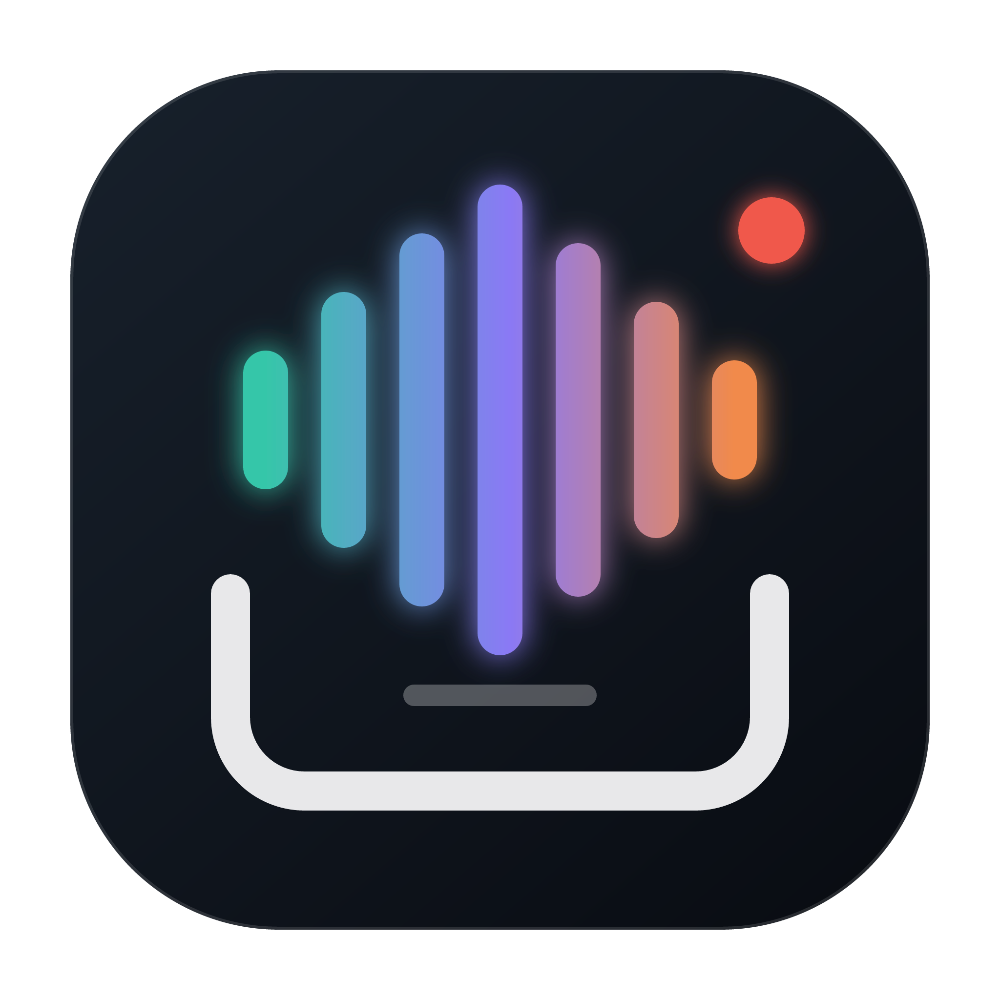
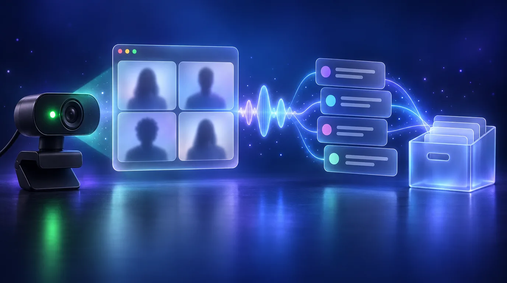

#  meeting-archive

Records your calls whenever an app picks up the mic and files them away for later

macOS

<!-- media: hero -->
<!--  -->
<!-- /media: hero -->



## What it is

This is still very much a preview. It's a menu-bar app that notices when an app on my Mac starts using the microphone, so Zoom, Teams or Meet in Chrome, Slack, FaceTime, WhatsApp and so on, and records the call as two audio tracks: my mic and whatever the Mac plays. When the app lets go of the mic it stops, and if the call was under a minute or nobody else spoke it just throws it away.

The first version recorded the meeting window as video when the camera came on, but that missed most of my calls (camera off, anything in the browser, phone calls) so now it's audio only.

When a call ends it gets a title from my calendar if there's a matching event, then goes off to my home server for transcription and speaker review, and it can end up in Notion too.

The home server is called Bruce in the scripts. Its worker is included in this
repo, but the disk paths and volume identity are specific to my setup. Read
[Adapting the worker](#adapting-the-worker) before installing it elsewhere.

## Get it

Paste this into your AI coding agent (Claude Code, Codex, Cursor...):

> Clone https://github.com/mikecann/meeting-archive and make it my own. It's one of Mike
> Cann's personal tools, so read the README first, change anything specific to his
> setup to suit mine, then help me get it running.

### Or set it up by hand

The capture app needs macOS 15 or later and Swift 6 or later. Install Xcode and
its command line tools. Full Xcode is needed for the XCTest suite. My worker
setup uses an Apple Silicon Mac, Python 3.13 and ffmpeg on PATH. The worker's
model packages are only needed for transcription, not for its unit tests.

```sh
git clone https://github.com/mikecann/meeting-archive.git
cd meeting-archive
bash install.sh
bash setup_mac.sh
open "$HOME/Applications/Meeting Archive.app"
```

`install.sh` links the `meeting-archive` command into `~/.local/bin`. You can
pass a different bin directory as its first argument. Add that directory to
PATH if needed. Re-run it after moving the clone. `setup_mac.sh` builds and
signs the app, and `--with-launcher` can also create the default launcher.
Neither script downloads models or enables the Bruce worker.

Quit Meeting Archive from its menu before updating or rebuilding it so an
active recording can finish cleanly. `setup_mac.sh` and `restart.sh` won't
replace it while it's still running. Use `bash restart.sh` to rebuild and open
the staged app after a change.

The capture app needs no API keys. For local worker commands, copy
`.env.example` to `.env`, fill in your Hugging Face token and optional Notion
settings, then load them in your shell:

```sh
cp .env.example .env
# Edit .env before loading it. Quote values when they contain shell characters.
set -a
source .env
set +a
```

The Hugging Face token needs access to the configured pyannote diarization
model. The managed Bruce service loads a private credential file instead of
`.env`; see [worker setup](worker/README.md#bruce-background-service).

When a login item already exists, the setup script re-registers it through
LaunchServices and restarts the background agent. A replaced bundle is otherwise
refused by launchd (`EX_CONFIG`) until it is re-registered, and registering from
a shell does not count. The build signs with your Apple Development identity
when one is available, so the signature stays stable across rebuilds.

## Using it

Open Settings from the menu bar, allow the microphone, call audio and
notifications, and select the calendars you want to use. Allowing call audio
records a second of nothing so macOS asks you there and then, rather than in
the middle of your first call. Set the worker host and archive path to match
your worker installation, and enable launch at login if you want it running
after a restart.

After that you shouldn't need to do anything. When a call starts you get a
notification with Stop and Discard buttons, and the menu bar icon goes red.
**Record now** (⌃⌥⌘R) is there for anything it can't hear about, like a meeting
in the room, and **Never record** adds an app to the ignore list. Dictation
apps, AI voice apps and screen recorders are ignored out of the box, and you
can change that list in Settings.

If something goes wrong mid-call, like the mic stalling or AirPods switching
mode, it rebuilds that source and carries on with a bit of silence over the
gap. If the whole recording breaks it saves what it has and starts a new part.
I'd rather end up with two parts than lose the end of a meeting, which is what
happened with the first version.

The library shows transfer and processing progress, then lets you play the
recording and review the speaker names.

So far I've tested the pieces on my Mac but not a full real call on every app,
so treat it as a preview.

## Adapting the worker

The app defaults to host `bruce` and `/Volumes/CannMedia/MeetingArchive`. Change
the host and archive path in Settings. The worker scripts additionally lock down
my disk UUID, archive path, Notion data source, playback URL and Tailscale login.
Those guards are intentional, so changing a single environment variable is not
enough to adapt the managed service.

Before deploying on another machine, update the matching constants in
`worker/install-bruce.sh`, the worker service/viewer install and run scripts,
`worker/launcher/Sources/LauncherConfiguration.swift`,
`worker/launcher/Sources/main.swift`,
`worker/meeting_archive_worker/credentials.py`, and the remote path guards in
`Sources/MeetingArchiveApp/ArchiveTransfer.swift`. Keep volume and path checks
in place, and run the tests again after adapting their fixtures.

On the worker Mac, install Python 3.13 and ffmpeg, then run
`bash worker/install-bruce.sh` from this clone after adapting those settings.
It copies the worker into the configured external archive runtime and installs
`worker/requirements.txt` in a dedicated virtual environment. Build the
[worker launcher](worker/launcher/README.md), grant its disk access from Finder,
and follow the [service setup](worker/README.md#bruce-background-service).
Notion and the [private playback viewer](worker/VIEWER.md) are optional and need
their own configuration. Check your backup coverage before enabling local cleanup.

## Development and tests

Run these from the clone root:

```sh
swift test
PYTHONPATH=worker python3 -W error::ResourceWarning -m unittest discover -s worker_tests
bash verification/run-contract-roundtrip.sh
bash verification/run-offline-regressions.sh
bash verification/run-rebuild-guard-tests.sh
bash worker/launcher/run-tests.sh
```

The Python tests use the standard library and synthetic media. Install ffmpeg
to include the playback tests. These commands do not download models, use
credentials or start the capture app. GUI harnesses, live transfer and
real-media validation in
`verification/` are separate manual checks that need permissions, fixtures or
your worker host. CI runs the offline checks on macOS.

The existing `com.mikerosoft.meeting-archive` app and service identifiers stay
unchanged so settings, permissions and login items keep their identity.

## First launch and privacy

Open the staged app yourself, then use Settings to request the permissions it
needs. macOS may require reopening the app after granting them:

- Microphone, for your side of the call. It keeps recording even when you're
  muted in the call app
- System Audio Recording Only, for everyone else on the call. There's no way
  for the app to check it, so if a call ever comes out with only your side, it
  tells you to look in System Settings
- Notifications, so you can see when it's recording and stop or discard it
  from the banner
- Calendar access, after adding your accounts in macOS Internet Accounts;
  select the calendars to use for titles and speaker suggestions

It doesn't need Screen Recording, Accessibility or camera access anymore.

The app can register or unregister its login item from Settings. The standalone
`uninstall-startup.sh` does the same startup-only unregister through Apple’s
documented `SMAppService` API and does not delete recordings or archive data.

## Bruce archive and cleanup

The configured Bruce archive path is `/Volumes/CannMedia/MeetingArchive` on
host `bruce`. Before enabling the cleanup toggle, verify that this exact
directory is covered by Bruce’s existing backup. A successful network transfer
alone is not evidence of backup coverage. Cleanup is allowed only after the
worker validates every declared media stream, rechecks the manifest, and saves
its durable processing job.

Until that toggle is on, every recording stays in the local spool after Bruce
has verified it. That is the intended safe default. Audio only is a lot
smaller than the old video recordings, at roughly 100 MB an hour.

Transfers and Notion publication are retryable and recorded in durable local
state. Retries back off while Bruce is unreachable and are released as soon as
the Mac wakes or the network returns. A Notion outage does not repeat transcription or playback generation.
Existing files under the older `RecordedMeetings` location are left alone and
are not imported automatically yet.

Bruce uses a separate one-time drive permission for the
[worker launcher](worker/launcher/README.md). In my original installation, that consent
was complete and the managed worker passed startup, clean shutdown, and automatic
restart. A solo recording completed processing and publication after a disk
priority correction and retry. That does not verify a new installation or an
actual reboot.

## Recording and naming

Recording follows the app holding the mic. It checks about once a second with
Core Audio, which doesn't need any permission, and helper processes are traced
back to their app, so a Meet call in Chrome shows up as Google Chrome. Once the
app has let go of the mic for 30 seconds the recording ends. If a different app
picks up the mic, that becomes a new recording straight away.

There's no naming prompt anymore. The title comes from a matching calendar
event, otherwise it's something like "Zoom call 1 Oct 2026 at 11:02 am". You
get 90 seconds to discard it from the menu or the notification before it goes
to Bruce, and you can rename it from the library.

An archived meeting can be renamed from the library with **Rename…**. Bruce
stores the new title next to the archive and republishes Notion; nothing is
re-uploaded or re-transcribed.

If the mic never starts, the call audio is still recorded, and the other way
round. A recording that caught nothing at all isn't kept.

The app logs capture, detection and transfer events to the unified log:

```sh
log show --predicate 'subsystem == "com.mikerosoft.meeting-archive"' --last 1d
```

## Review and current limits

Speaker review never pops up. When Bruce has worked out who spoke, the menu
bar shows how many voices still need a name, with a **Review speakers** entry
for each meeting, and the library has a **Name speakers…** button. Review
whenever you like; archiving and later recordings don't wait for it.

The review window has one card per person. pyannote often splits one person
into several voices, so voices with the same name share a card, like
**Micah · 2 voices** with samples from each. Typing or choosing a name another
card already has merges the two, and **Not Micah** takes a voice back out.
Voices Bruce recognized are filled in and marked **Recognized**; its guesses
are filled in and marked **Suggested**. **Save names** saves every name that's
filled in, whether you typed it, chose it or Bruce did, in one go. Anyone left
blank stays unknown, and you can save and close with blanks. If the save
fails, the window stays open with the error and nothing is marked saved, so
**Save names** again retries. **Later** closes without saving.

Bruce asks less as it hears people again. Your own mic is named for you as
soon as you've saved your voice in one meeting, a voice that matches someone
saved in two earlier meetings is named automatically, and a voice split off
from one you saved in the same meeting gets that name too. Saving a name also names the
same voice in other meetings still waiting for review, in the background.
Automatic names never train the voice profiles; only names you save do.
Similarity scores are not confidence percentages.

The library supports playback, transcript access, and speaker review after a
processed archive is available. Calendar attendees are only offered as names
to choose; they never fill in a name by themselves. Keep the app’s minimal
settings explicit: selected calendars, Bruce host and archive path, and the
backup-coverage confirmation.

Do not describe the app as production-ready until a representative live run has
verified recording, transfer, retries, and review on your installation.

The app icon is drawn in `icons/meeting-archive.svg`, with `icons/meeting-archive.png`
rendered from it.

## More tools

My other tools are at [mikerosoft.app](https://mikerosoft.app).

MIT licensed.
